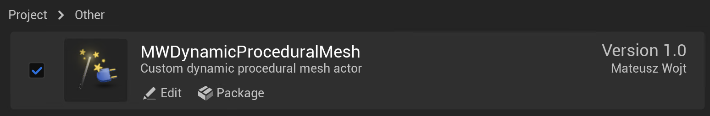
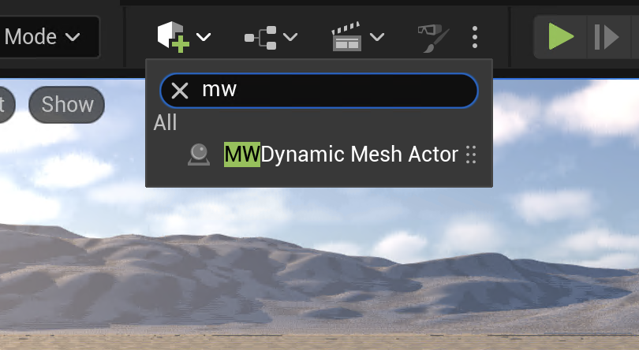
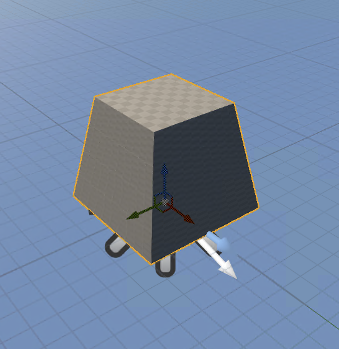
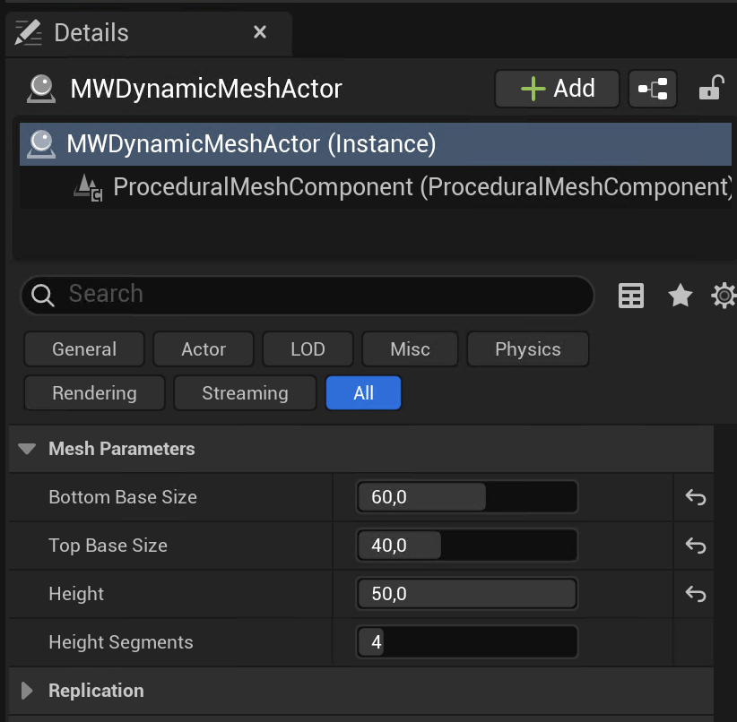

# MWDynamicProceduralMesh

Unreal Engine plugin that allows you to create procedural truncated pyramid meshes with real-time parameter adjustment directly in the editor.

## Installation

1. Copy the plugin files into `<YourProject>/Plugins/MWDynamicProceduralMesh`
2. Open project in Unreal Engine
3. Compile the plugin if asked on project load
4. Enable the plugin in Edit → Plugins → Project → Other

## Usage
### Adding a Dynamic Mesh Actor

1. Open the Place Actors panel (Window → Place Actors)
2. Search for "MWDynamic Mesh Actor" in the search bar to filter the actors
3. Drag and drop the `MWDynamic Mesh Actor` into your level

### Available Parameters

Search for Mesh Parameters section in the actor details panel to modify the look of the generated mesh.

You can control the bottom and top face size, the height of the pyramid and number of segments.

